# 💫 I'm Abhinav Gomra

🎓 Pursuing an Integrated M.Tech in Data Science  
💻 Interested in Data Science, AI & Full Stack Development  
🚀 Building and experimenting with real-world projects  
🌱 Continuously learning new technologies and development tools  
🤝 Open to collaborating on interesting tech projects  
🧠 Passionate about problem-solving and learning by building  
⚡ Always curious about what I can build next  

---

## 🌐 Connect With Me

---

# 💻 Tech Stack

### 👨‍💻 Languages

### 🌐 Web Development

### 🤖 Data Science & AI

### 🗄️ Databases

### ☁️ Cloud & Tools

### 🎨 Design

---

# 📊 GitHub Stats

---

# 🏆 GitHub Trophies

---

# 🐍 Contribution Snake

---

# ✍️ Random Dev Quote

---

### ⚡ Keep Building. Keep Learning. Keep Exploring.

---

